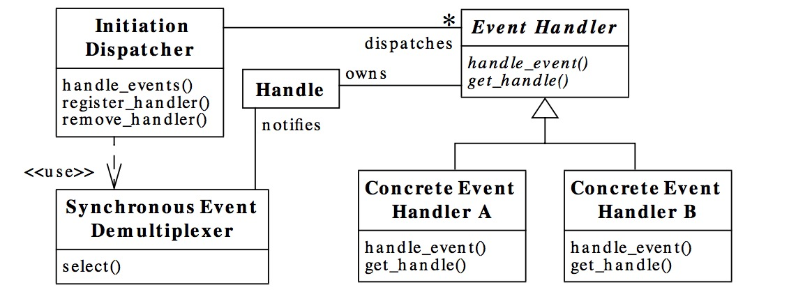

Reactor模式角色构成（5中角色）：

### 1、Handle（句柄或是描述符）
本质上是一种资源，是由操作系统提供的；该资源用于表示一个个的事件，或是针对网络编程中的socket描述符。
事件即可以来源于外部，也可以来自于内部；外部事件：客户端的连接请求/发送数据等；内容：操作系统的定时器事件。
它本质上就是一个文件描述符。Handle是时间产生的发源地
### 2、syncronous event demultiplexer (同步事件分离器)
本身是一个系统调用，用于等待时间的发生（事件可以是一个/多个）。调用方在调用的时候会被阻塞，一直阻塞到同步
分离器上有时间发生为止。对于linux来说，同步时间分离器指的就是重用的I/O多路复用机制(事件驱动模型还有另外一个名字，而且更加出名的名字：io多路复用).
比如select、poll、epoll等，在NIO领域中，对应组件是SELECTOR，对应阻塞方法是select
### 3、event handler（事件处理器）：
本身是由多个回调方法构成，这些回调方法构成了与应用相关的对于某个事件的反馈机制。Netty对于nio来说，在事件处理器这个
角色上进行了升级，为开发者提供了大量的回调方法，供我们在特定事件产生时实现相应的回调方法进行业务逻辑处理。
### 4、concrete event handler(具体事件处理器)：
事件处理器的实现。实现事件处理器提供的回调方法，从而实现特定的业务逻辑。本质上是开发者锁编写的一个个的处理器实现。
### 5、 Initiation Dispatcher (初始分发器)：
实际上就是对于NIO的reactor角色。本身定义了一些规范，这些规范用语控制事件的调度方法，同时又提供了应用进行应用
进行事件处理器的注册、删除等设施。它本身是整个事件处理器的核心所在，Initiation Dispatcher会通过同步事件
分离器来等待事件的发生。一旦事件发生，Initation Dispatcher首先分离出一个事件，然后调用对应的时间处理器，
最后调用相关回调方法来处理这些事件。

执行流程：
* 1、应用向Initiation Dispatcher注册具体的时间处理器时，应用标识出该时间处理器希望Initiation Dispatcher在
某个事件发生时向其通知该事件，该事件与handle关联
* 2、Initiation Dispatcher会要求每个时间处理器向其传递内部的handle。该handle向操作系统标识了事件处理器
* 3、当所有的时间处理器注册完毕后，应用会调用handle_events方法来启动Initiation Dispatcher的事件循环。
这时，Initiation Dispatcher会将每个注册的事件管理器的handle合并起来，并使用syncronous event demultiplexer
等待事件发生
* 4、 当某个handle的事件状态变为ready时，同步分离器就会通知Initiation Dispatcher
* 5、 Initiation Dispatcher会触发事件处理器的回调方法，来响应处于ready状态的handle。当事件发生时，
Initiation Dispatcher会将被事件激活的Handle的key来寻找并分发恰当的事件处理器回调方法
* 6、 Initiation Dispatcher会回调 事件管理器的handle_events回调方法来执行特定于应用的功能（业务代码），
从而响应这个事件。

## scalable io in java 是Doug Lea大神关于io多路复用的文章，写的很好！
